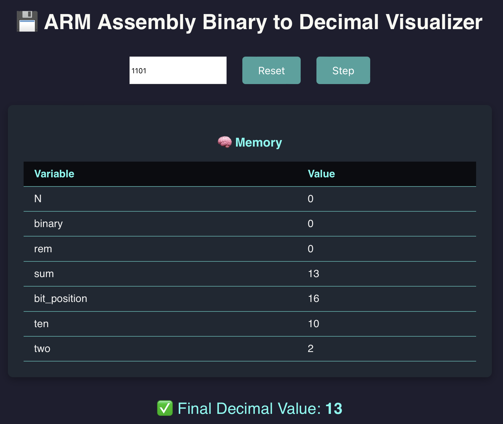

# 💾 ARM Binary to Decimal Visualizer

This interactive React application visualizes the step-by-step execution of an ARM Assembly program that converts a **binary integer** into its **decimal equivalent**.

Built with a clean and modern UI, this tool is perfect for students, educators, and enthusiasts learning low-level binary computation and instruction flow in assembly language.

## 📸 Screenshot



## 🚀 Live Demo

You can view the deployed app here: [https://armbinary.netlify.app](https://armbinary.netlify.app)

---

## 🚀 Features

- ✅ Input a binary number and simulate ARM Assembly logic
- 🔁 Step through each instruction manually to see register updates
- 💡 View memory/register states in real-time
- 📊 See the final decimal output when conversion completes
- 🎨 Modern, responsive, and visually appealing UI

---

## 🧠 Background

The original ARM Assembly program works like this:

1. Reads a binary input (e.g. `1101`)
2. Iterates over each digit
3. Converts it to decimal using multiplication & positional logic
4. Prints the final decimal equivalent

This app reproduces that process visually using JavaScript logic that mirrors ARM instruction steps like `load`, `div`, `mul`, `add`, `store`, and `ble0`.

---

## 🛠 Tech Stack

- React (via `create-react-app`)
- JavaScript
- Custom interpreter logic for ARM Assembly behavior
- Styled with modern CSS and animated components

---

---

## 🧪 How to Run Locally

1. **Clone the repository**
```bash
git clone https://github.com/TrishaAndres/arm-binary-visualizer.git
cd arm-binary-visualizer
```

2. Install dependencies
```bash
npm install
```

3. Run the development server
```bash
npm start
```

4. Open your browser and go to http://localhost:3000

